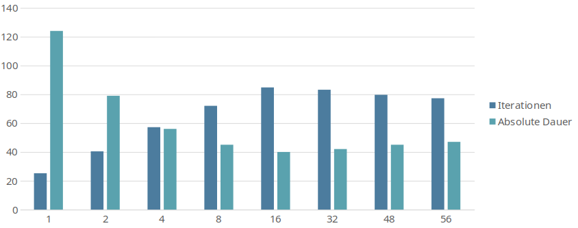
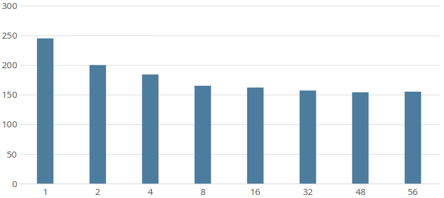

# Create a config/profile
This Howto will explain how to create a config file. It's using the exam


While in theory all parameters could be set via cli, this is impractical because of the large amount of required parameters. 
All parameters have default values defined in the default profile. 
We will now create a config file which overrides the most important parameters. Later you will likely change more parameters e.g. to optimize training/quality or depending on your runtime modules.
**All available parameters are described [here](../configs)**

*Note*: CLI parameters always have the highest priority and will overwrite whatever is set in config files.

- **dataset**: Give your dataset a beautiful name :) 
- **data_root**: Absolute path to your datasets root directory 
- **work_dir**: Absolute path to your working directory (log directory). Most outputs will be stored there (trained models, recorded videos, etc). Some modules might also use this directory for temporary data.
- **note** (*optional*): The train module will create a new directory, under your working directory, every time you start training. This note will be used as a suffix for the folder name. This suffix will make it easier to recognize these folders.  
- **h_samples**: see below
- **img_height**: The height of your input images. You might change this value later in runtime-mode 
- **img_width**: The width of your input images. You might change this value later in runtime-mode
- **epoch** (*optional*): The number of epochs you want to train. The default value (100) is a good value, but might be too high for quick tests 
- **batch_size**: see below 


## h_samples
The h_samples defined by your dataset. 
For further explanations on what h_samples are, see [HOWTO: Create dataset - labels file specification](./create_dataset.html#labels-file)
The h_samples are defined in the config as relative values between 0 and 1. The h_samples are required multiple times for different resolutions, e.g. for the net's resolution which is per default 288px in height. By defining it with a relative height it is really easy to scale the h_samples for the individual heights.

An easy way to scale the h_samples from the dataset to values between 0 and 1 is by dividing them by the image height. This can be easily done with a generator `[x/<image height> for x in [<h_samples>]`. To further simply this statement the `range()` function could be used here. 
It's preferred to calculate the values here instead of pre-calculating them because they have to be very exact. Nevertheless, it's also possible to use precalculated values here.
Because of that, this parameter can't be set via CLI. 

**Important**: Don't use the img_height variable in this generator. img_height might be changed later. This would result in a wrong scaling of the h_samples.


## batch_size
This value will depend on many factors.

- **training mode**: The maximum value is limited by your VRAM. For a RESNET18 (default) 11GB of VRAM the maximum is about 56. Finding the best value requires some testing. Too low values drastically decreases performance. Too high values can also result in lower performance. The batch_size can also affect the accuracy. Something around 16 might be a good starting value.
- **runtime mode - evaluation / test**: If the output does not have to happen in realtime simply find the batch_size providing the best performance
- **runtime mode - realtime / live**: For realtime outputs like video preview or production use the batch size should be set to 1. Everything higher will increase FPS but also the latency. The higher FPS aren't useful in this case because only the latest sample of the batch will be of interest.

This diagram shows performance measurements on a 2080Ti and an i7 8800k. 
It shows that the best performance can be achieved with a batch size around 16. 



Note that the total CPU overhead continues to decrease with higher batch sizes, which can be seen in the next diagram showing the total cpu time.



## Example config

``` python
dataset = 'Example profile'
data_root = '/home/user/datasets/example_dataset/'
work_dir = '/home/user/work_dir/'
note = '_ex_prof'
h_samples = [x/720 for x in range(160, 711, 10)]
img_height = 720
img_width = 1280
epoch = 100
batch_size = 16
```