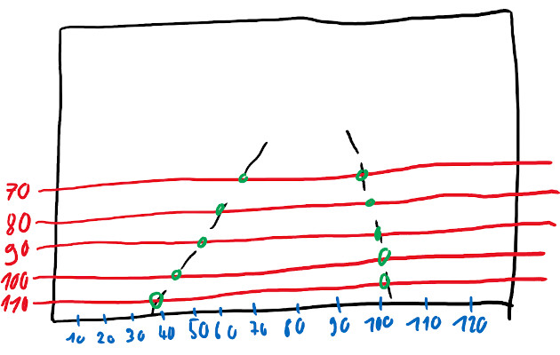
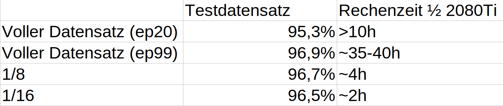

# HOWTO: Create a dataset
This Howto explains how a to create a dataset and which specifications it has to fulfill. It does not cover the "data collecting" part. For this Howto i expect you to already have labeled data.

- [This Howto](generate_dataset_from_carla) shows how to generate labeled data from CARLA.
- The [TuSimple](https://github.com/TuSimple/tusimple-benchmark/issues/3) dataset is also compatible with this howto. The TuSimple section describes the particularities to be followed
- The [CULane](https://xingangpan.github.io/projects/CULane.html) dataset can also be used here, but requires some additional steps which I will not treat here.

## Specifications:
### Source for this HOWTO
You need a folder containing:
- a folder containing JPEG images
- a labels file

A sample dataset containing 100 images is available here:
```{eval-rst}
:download:`sample_dataset.zip <../_static/sample_dataset.zip>`
```
You can use this dataset to complete this Howto.


#### Images
The structure of the image folder doesn't matter. In theory, you don't even need a separate folder for your frames.

**Image file type**: Probably other image types will also work, but only JPEG is tested. I would recommend to stick to JPEG.

**Image resolution**: Per default the net will work with scaled images with a resolution of 288x800. Use this resolution as a reference. We use 1280x720. Higher resolutions will also work, but i wouldn't go too high as this might decrease performance. I would suggest something between 1280x720 and 1920x1080, but I haven't done any tests on this topic.

### Labels file
This file contains a list of stringified JSON-Objects, **not** a JSON-Array. Every object has to be a one-liner. One line will be called a "sample".

Every sample has three attributes
- lanes: a list of lanes. There will always be exactly four lanes. The order of the lanes doesn't matter. A lane is a list of i x-coordinates, where i has to be always the same and always the same as for h_samples
- h_samples: a list of y coordinates
- raw_file: relative path to corresponding image

#### Addressing lane-points on image
The lanes are not handled as lines. Instead they are represented as a list of points. Every point 


Lanes are not handled as lines. Instead, they are represented as a list of points. Not every pixel on which a line is visible is part of this list. A list of h_samples is defined, which define the resolution of the rasterization. Each intersection of a road marking with the h_samples is stored in the list of points.

Addressing in y-direction is done from top to bottom. The topmost h_sample should be chosen around or slightly above the horizon. If it is chosen too high, it will never be used. If it is chosen too low, lanes could not be recognized up to the horizon. For the h_samples a distance of 10 pixels is usually chosen but this can be chosen individually.

The following sketch shows in red the h_samples (70, 80, 90, 100, 100). The intersection points of the road markings with the h_samples are marked in green. This example results in the following lane arrays:

```
1: [67, 60, 54, 45, 39]
2: [98, 99, 100, 101, 102]
```

Since there must always be exactly four lines, two more have to be added. However, since there are no more on the image, they must be assigned to the rest class. Non-existing intersections receive the value `-2`. Since the two non-existent lines obviously belong completely to the rest class, each value in the arrays has the value -2.



This provides all the necessary information for a label. The following JSON object results for the sketch:
```
{
    "lanes": [[-2, -2, -2, -2, -2],[67, 60, 54, 45, 39], [98, 99, 100, 101, 102], [-2, -2, -2, -2, -2]],
    "h_samples: [70, 80, 90, 100, 110],
    "raw_file": "sketch_labels.jpg"
}
```
When saving to the labels file, the line breaks within the objects must be removed!


### Input for this project - aka result of this HOWTO
There have to be separate label files for training, testing and ideally for validation. Also there have to be index files and segmentation images.

- **segmenatation images**: For each training frame there has to be a segmentation-label image. This is a black grayscale image with the lanes drawn on them. The color value of the drawn lanes is 1, 2, 3 and 4 from the left to the right
- **separate label files**: simply the original label file splitted into multiple files. 80% train and 20% test are good values here.
- **index files**: Every line contains the path to one frame. In case of training it also contains the path to the segmentation label image and an indicator showing which lane markings exists.  
Eg (training): `dataset/clips/000/Left/right_curve/0143.jpg dataset/clips/000/Left/right_curve/0143.png 1 1 1 0`

## Prepare the dataset
Now that we hopefully understand the dataset specifications we can start to convert/preprocess the dataset.


### Split labels
This can be done with the script [split_dataset.py](../scripts). Simply open that file, insert your labels-file path and how much of your dataset should be used for testing and validation (as percent) and run it. This will create the files `train_labels.json, test.json, validate.json` in the same folder as your source file is located. Make sure these files don't exist, otherwise the script will fail.

This script will take the data from different locations of the source file (per default: 10) to prevent the creation of unbalanced records.

### Reduce amount of train data
Training with large datasets will take a huge amount of time. Especially if the dataset was recorded at a high framerate this script could be used to decrease training time by creating a smaller train_labels file.

The following screenshot shows the results of one of our largest datasets. As you can see, by scaling down the training dataset, the training duration can be drastically reduced with only a slight loss of accuracy. 



You can use the script [create_smaller_train_set.py](../scripts) to scale your dataset. This script will create a new labels file and won't modify any other files.
Edit the file and set your path, the scaling percentage and the filename to the function call at the bottom of the file. Now run the script.

*Hint*: If you are using the provided sample dataset you should skip this step.


### create segmentation labels and index files
These files can be created with the help of [create_seg_labels_and_index_files.py](../scripts). Run this file from the command line. A sample call could be:

```
python scripts/create_seg_labels_and_index_files.py --root "/home/markus/sample_dataset/" --train_files train_labels.json --test_files test.json
```

This might take 1-2 Minutes to complete.

The script currently does not support validation files. One way to proceed with `validate.json` would be to run the script again and replace `test.json` with `validate.json`.

This step often reveals mistakes in dataset creation. For a quick validation you can just run this script. If it completes without errors or warnings your dataset ist probably valid in terms of syntax. 

### validate data
Its easy to make mistakes when creating a dataset. It might be a good idea to visually validate the dataset before you waste hours training garbage. "Garbage in, garbage out". We did not do this earlier as we can now use the smaller `train.json` or `validate.json` files for that step. Also the dataset passed our "semantic validation" from the previous step.

The script [show_labels_on_image.py](../scripts) takes a labels file name and a data(set) root. It will show the frames with the labels drawn on them.

Edit the file and enter your path and filename to the function call at the bottom of the file. Now simply run the file and watch.

*Hint*: If you are using the provided sample dataset you might want to use the `train_gt.json` file for this step because this dataset is really small.


## TuSimple
This dataset is already divided into a train and test dataset. Therefore this step can be skipped. The remaining steps are applied unchanged.
``` shell
python scripts/create_seg_labels_and_index_files.py --root /home/markus/master_project/tusimpleroot/ --train_files label_data_0601.json,label_data_0531.json,label_data_0313.json --test_files test_tasks_0627.json
```
