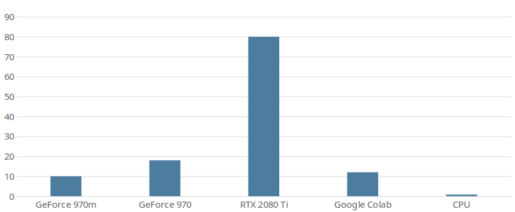

# Project setup
## Requirements
This project requires a Cuda compatible (NVIDIA) GPU. Training with CPU is practically impossible.

I ran some tests on different Hardware and also tried training on CPU. 
The following diagram shows my results.
I used the default settings (RESNET18, griding_num=100, train_res 800x288, img 1280x720), cls_num (h_samples) was something around 40.
Batch_size depended on hardware (e.g. 4 for 970, higher for 2080 Ti).



**Note**: When using the 2080 Ti i was in the CPU limit of pythons main thread. GPU usage was around 80-90%.

The runtime package could probably run also on CPU only. 
This is currently not supported, but the required changes are probably minimal (remove all `.cuda()` calls in the runtime package).

## Training without CUDA capable GPU
Like explained above training without a CUDA GPU is not possible, so you have to get somehow access to one.
There are cloud-gpus which you can rent for around 2-4 euro per hour.
A free option is using Google Colab. 
It provides Jupyter like notebooks in the cloud which can be accelerated with a gpu. 
Performance is not that good, but it's enough to start with. 
It's also possible to train on larger datasets, but it will take some time.

To train with Colab 
1. Upload this project and your dataset to Google Drive.
2. Create a new notebook
3. Mount Google Drive
   ```python
   from google.colab import drive
   drive.mount('/content/drive')
   ```
4. Install some missing dependencies
   ```shell
   !pip install addict pathspec
   ```
5. Activate GPU Acceleration: Laufzeit -> Laufzeittyp ändern -> Hardwarebeschleuniger -> GPU
6. Start training
   ```shell
   !cd /content/drive/My\ Drive/ufld/Ultra-Fast-Lane-Detection/ && python ufld.py configs/sample_dataset.py --mode train
   ```

A Colab instance will stay open for up to 12 hours if you keep the notebook open in your browser.
A closed notebook will be stopped after 1h30min.
Also have a look on your Google Drive's storage.
The model is saved after each epoch and as they are quite large (>0,5GB) they will consume a lot of storage.

**Hint**: Training can be resumed with the help of the `resume` parameter.


## Setup
1. Clone the project

    ```Shell
    git clone <git link>
    cd Ultra-Fast-Lane-Detection
    ```

2. Next step is to setup the interpreter environment. This does not have to be a conda env.  
   Create a conda virtual environment and activate it

    ```Shell
    conda create -n lane-det python=3.7 -y
    conda activate lane-det
    ```

3. Install dependencies
   torchvision is not compatible with every `cudatoolkit` version. See pytorch documentation to see supported versions.

    ```Shell
    # If you dont have pytorch
    conda install pytorch torchvision cudatoolkit=10.1 -c pytorch 

    pip install -r requirements.txt
    ```
