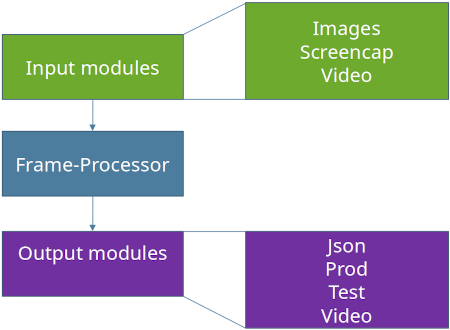

# src.runtime package
The runtime package contains the logik required to work with a trained model. It covers many scenarios like accuracy testing, visual previews or production use.
To be as flexible as possible this package was build with modularity in mind. 

The basic structure of this package is shown in the following diagram.



## runtime.py / FrameProcessor
The entry point for this module is [runtime.py](./src.runtime.runtime). It covers multiple responsibilities.
- Setup input module
- Setup output module
- Setup neural network (load trained model from disk)
- Start input module

This file also contains the [FrameProcessor](src.runtime.runtime.FrameProcessor). This class doesn't really do much.
It's only a wrapper arround the net() call.

## Input modules
Input modules are responsible for supplying data to the FrameProcessor. 
Possible data source can be, among others, cameras, videos, screen recording or image files.
Only one input module can be used per application instance.

See [input modules](./src.runtime.modules.input) for further information.

## Output modules
These modules will do something useful with output data of the neural network. 
This could for example be an accuracy test, a live preview or a json export.

Multiple output modules can be used simultaneously. 
This is an easy way for example to additionally display a live video that shows the detected markers. 
However, this simplicity is at the expense of performance, since the same calculations are probably performed several 
times in the different modules. If a frequent use of such a scenario is planned, especially if performance is relevant, 
another module should be developed which combines the respective modules. 

See [output modules](./src.runtime.modules.output) for further information.

## Measure performance
To benchmark the runtime just set `measure_time` to `True`. 
This will log the time each frame took to stdout. 
When the application exits, you will also see the average values over the whole execution. 
You will get three values:
- real fps
- fps without output module
- fps without output module and without input module

## Subpackages

```{toctree}
---
maxdepth: 1
---
./src.runtime.modules
./src.runtime.utils
./src.runtime.runtime
```


